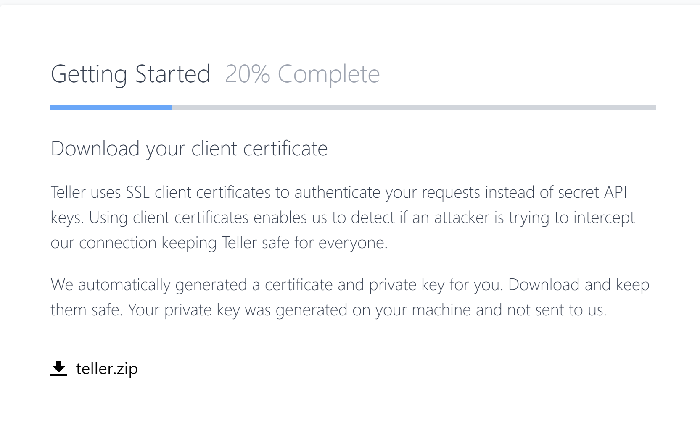
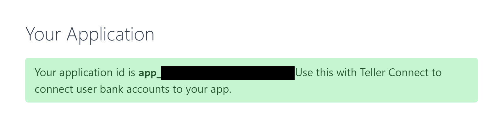
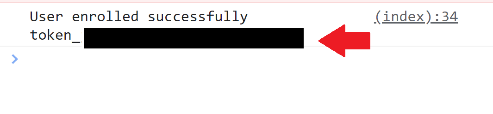
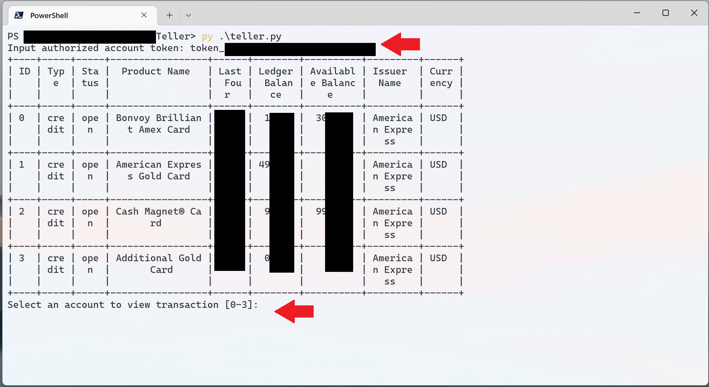
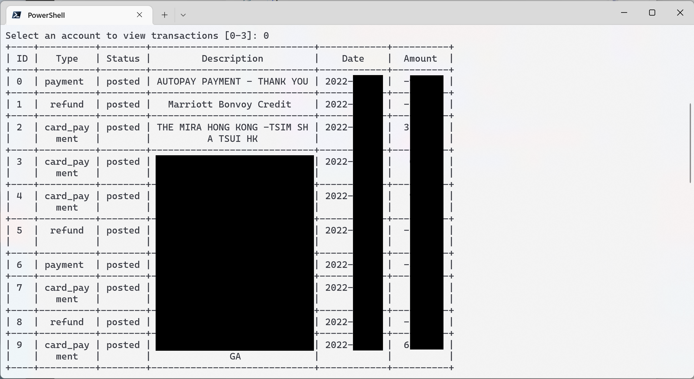

# Teller Demo App: Bank Account Enquiries & Statement CSV Export

Retrieve savings/checking/credit card account details from selected US financial institutions with Teller API


## Functions

- View the summary of accounts linked to an online banking account
- View transactions for a selected account
- Export transactions to CSV file

## Getting Started

### Teller.io Registration

1.  Get a Teller account through [teller.io](https://teller.io)

2.  Follow the instructions to set up your account then download your certificate and private key

    

3.  Find your `appId` in the "Application" tab

    

### Frontend & Backend Setup

1.  Install dependencies for `teller.py`

    ```
    pip install -r requirements.txt
    ```

2.  Replace `PATH_TO_CERTIFICATE` and `PATH_TO_PRIVATE_KEY` in `teller.py` with the paths of the certificate and private key you downloaded from Teller

3.  Replace `APPLICATION_ID` in `public/index.js` with the `appId` of your own Teller instance

### Authorize Your Bank Account

1. Authorize Teller API to access your/your client's bank account by visiting `index.html` and following the instrunctions (you may use the [Live Server](https://marketplace.visualstudio.com/items?itemName=ritwickdey.LiveServer) plugin in [VS Code](https://code.visualstudio.com/) to open the frontend UI locally)

2. Open the developer console (press `F12` and navigate to "Console"), you will find the authorization token for this account

   

### Accessing Your Account

1. Run the Python script

   ```
   python teller.py
   ```

2. Enter the token for the account you wish to access

   

   

### Using MongoDB for Token Storage

Simply change `<MONGODB_CONNECTION_STRING>` and `<DB_PASSWORD>` to your MongoDB connection string and password in `config.env`. Account access tokens will be inserted to database when a client completes authorization.

## License

Distributed under the MIT License. See `LICENSE.md` for more information.

## Contact

Project Link: [https://github.com/songyuew/teller](https://github.com/songyuew/teller)

## Acknowledgments

- [Teller](https://teller.io/)
- [Teller API Docs](https://teller.io/docs)
